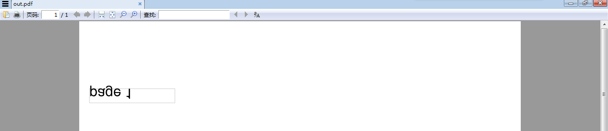

I try to add page number on pdf page. The prefer text postion is the center of the bottom. The initial code seems very clean
```python
import fitz

fnPdfIn, fnPdfOut = 'blank.pdf', 'out.pdf'

doc2 = fitz.open()
pdfIn = fitz.open(fnPdfIn)
doc2.insertPDF(pdfIn)

for idxPage in range(len(doc2)):
    page = doc2[idxPage]
    _, _, wid, hi = page.MediaBox

    text =  'page %i' % (idxPage+1)

    # method 1: insertText
    #~ where = fitz.Point(wid*0.5, hi-10)
    #~ page.insertText(where, text, fontsize=fontsize, )

    # method 2: insertTextbox
    rect = fitz.Rect(
        wid/2-fontsize*len(text)/2, hi/2-fontsize/2,
        wid/2+fontsize*len(text)/2, hi/2+fontsize/2
    )
    page.drawRect(rect, color = (0.5, 0.5, 0.5), overlay=True)
    page.insertTextbox(rect, text, fontsize=fontsize)

doc2.save(fnPdfOut)
doc2.close()
```

however
1. I met one or two bug
I use [PyMuPDF-1.16.10-cp36-none-win_amd64.whl](https://pypi.org/project/PyMuPDF/#files), which is built on Dec 22, 2019, with Python3.6.
For some of my PDF files, the code works. But for some, no. For example `blank.pdf` which is exported from a blank file form [Typora 0.9.81(beta)](https://typora.io/) on Windows 7 64 bits. The text is flipped no matter I use `insertText` or `insertTextbox` as you can see on  .

And what is more, the text is not located around the center.

So how to fix it/them?

2. This is not a bug
how to make the center of the text located exactly the center of the bottom? In my case, some unicode characters are in text

2. This is not a bug
'new times roman' will be used for English letters and numbers, a unicode font( for example, "C:\Windows\Fonts\simsun.ttc") will be used for unicode characters
what is the easy way to assign font for the text?

thanks

